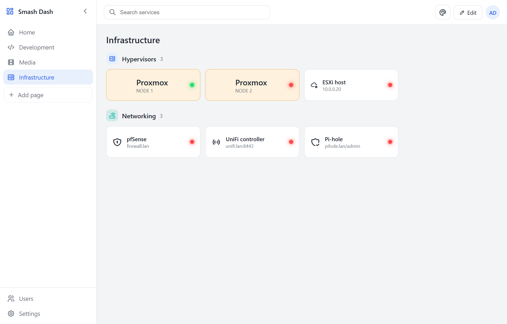

# Smash Dash

A self-hosted dashboard for your servers, services, and links — **configured entirely in the app**. No YAML, no config files. Organize everything into **pages → sections → tiles**, with multi-user access and full theming.

📖 **[Full installation & user guide →](docs/USAGE.md)** — step-by-step, with screenshots.



## Features

- **Pages → sections → tiles** — tabbed pages in a retractable side rail, titled sections inside each, and link/server tiles inside those.
- **Configured in the browser** — add, edit, reorder, and delete everything in an admin edit mode. Drag to reorder pages, sections, and tiles.
- **Retractable sidebar** — collapse it to icons; the state is remembered per user (and in the browser).
- **Changeable icons** — pick from a built-in icon set, type any [Tabler](https://tabler.io/icons) icon name, or use a custom image URL. Icons are self-hosted, so they work offline.
- **Multi-user with roles** — `admin` (can edit everything) and `viewer` (view only).
- **Theming** — built-in themes (Dark, Light, Midnight, Slate, Nord) plus a full in-app theme editor. Each user picks their own; admin sets the default.
- **Status monitoring** — each tile shows a live status dot (green = up, red = unreachable) with response time on hover. The server checks each service's URL (or an optional per-tile health-check URL) on an interval; self-signed certificates are accepted, and any HTTP response counts as "up".

## Run with Docker

```bash
docker compose up -d --build
```

Then open `http://<host>:3000` and sign in.

**First run creates the admin account** from `ADMIN_USERNAME` / `ADMIN_PASSWORD` in `docker-compose.yml` (defaults `admin` / `admin`). Change them before first boot, or change the password later under **Users**. The account is only seeded once — it lives in the database volume.

### Environment variables

| Variable | Default | Purpose |
|---|---|---|
| `PORT` | `3000` | Listen port |
| `DATA_DIR` | `/data` | Where the SQLite database lives (mount a volume here) |
| `ADMIN_USERNAME` | `admin` | First-run admin username |
| `ADMIN_PASSWORD` | `admin` | First-run admin password |
| `COOKIE_SECURE` | `false` | Set `true` when served over HTTPS |
| `CHECK_INTERVAL_MS` | `30000` | Default status-check interval in ms (`0` disables). Also adjustable in **Settings** (overrides this) |
| `CHECK_TIMEOUT_MS` | `5000` | Per-service status-check timeout in ms |
| `TZ` | — | Container timezone |

Data persists in the `smashdash-data` Docker volume. Back it up by copying `smashdash.db` out of the volume.

## Run locally (without Docker)

```bash
npm install
npm start          # http://localhost:3000
```

Requires Node.js 20+. The database is created under `./data` by default.

## Tech

Node.js (Fastify) · SQLite (better-sqlite3) · vanilla JS frontend (no build step) · self-hosted Tabler icon webfont. Single container, single SQLite file.
