# Smash Dash — Installation & User Guide

A self-hosted dashboard for your servers, services, and links — **configured entirely in the browser**. No YAML, no config files. Everything is organised into **pages → sections → tiles**, with multi-user access, full theming, and live status monitoring.


---

## Contents

- [Installation](#installation)
  - [Option A — Docker (recommended)](#option-a--docker-recommended)
  - [Option B — Node, without Docker](#option-b--node-without-docker)
  - [First login](#first-login)
- [The basics: pages, sections, tiles](#the-basics-pages--sections--tiles)
- [Edit mode](#edit-mode)
- [Adding & editing a tile](#adding--editing-a-tile-service)
- [Icons & product logos](#icons--product-logos)
- [Tile appearance](#tile-appearance-size-colour-fonts)
- [Sections (categories)](#sections-categories)
- [Search](#search)
- [Themes](#themes)
- [Users & roles](#users--roles)
- [Your profile](#your-profile)
- [Status monitoring](#status-monitoring)
- [The sidebar](#the-sidebar)
- [Backup & data](#backup--data)
- [Configuration reference](#configuration-reference-environment-variables)

---

## Installation

Smash Dash is a single Node.js process with a single SQLite database file. The easiest way to run it is Docker; you can also run it directly with Node.

### Option A — Docker (recommended)

From the project folder:

```bash
docker compose up -d --build
```

Then open **`http://<host>:3000`** in a browser and sign in.

- Data is stored in the `smashdash-data` Docker volume (a single `smashdash.db` file), so it survives container rebuilds.
- The admin account is created on first boot from `ADMIN_USERNAME` / `ADMIN_PASSWORD` in `docker-compose.yml` (defaults `admin` / `admin`). **Change these before first boot**, or change the password later under **Users**.
- Set `COOKIE_SECURE=true` if you serve it over HTTPS (behind a reverse proxy).

### Option B — Node, without Docker

Requires **Node.js 20 or newer**.

```bash
npm install
npm start          # http://localhost:3000
```

The database is created under `./data` by default. For live-reload during development use `npm run dev`.

### First login

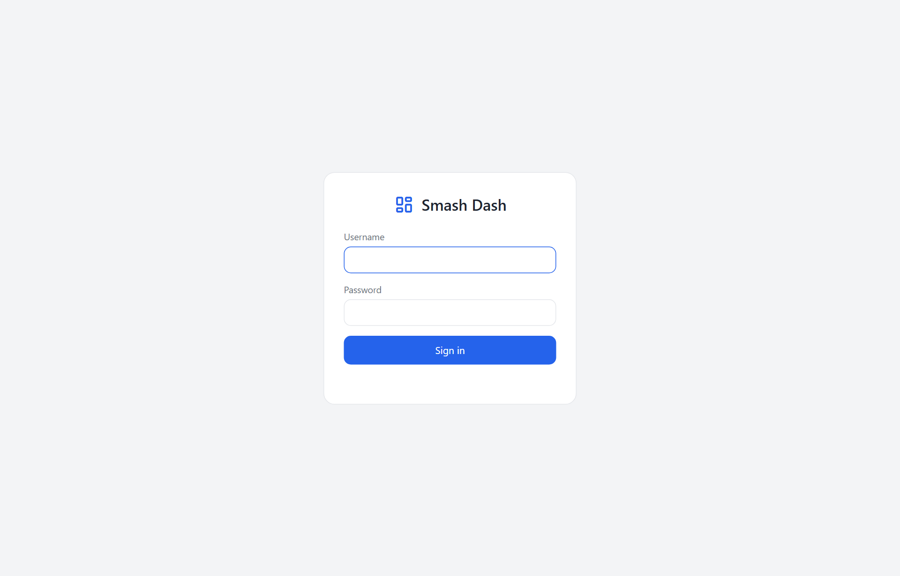

On a fresh database, sign in with the seeded admin account (**`admin` / `admin`** by default). The first run also creates a small sample layout so the dashboard isn't empty. Change your password right away under **Users**.

---

## The basics: pages → sections → tiles

Smash Dash has a simple three-level hierarchy:

| Level | What it is | Where it lives |
|---|---|---|
| **Page** | A tab in the left side rail (e.g. *Infrastructure*, *Media*) | The sidebar |
| **Section** | A titled category inside a page (e.g. *Hypervisors*, *Networking*) | Within a page |
| **Tile** | A single link/service card | Inside a section |

You can have as many pages as you like, multiple sections per page, and any number of tiles per section.

---

## Edit mode

Everything is configured in the browser. Click **Edit** (top-right, admin only) to turn on edit mode.

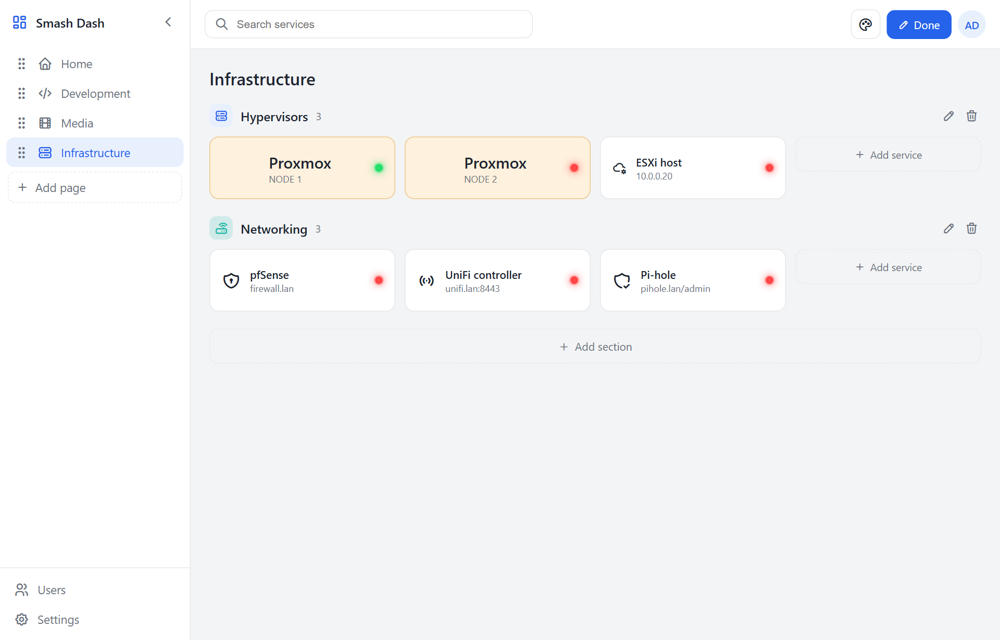

In edit mode you can:

- **Add** — an *Add page* button appears in the sidebar, *Add section* at the bottom of a page, and *Add service* inside each section.
- **Edit / delete** — hover a page, section, or tile to reveal its edit (✎) and delete (🗑) controls.
- **Reorder by drag** — drag pages in the sidebar, drag sections, and drag tiles (including from one section to another). The order is saved automatically.

Click **Done** when you're finished.

---

## Adding & editing a tile (service)

Click *Add service* (or click an existing tile in edit mode) to open the tile editor.

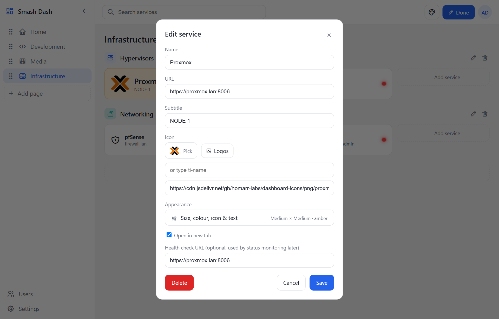

- **Name** — the title shown on the tile.
- **URL** — where the tile links to when clicked.
- **Subtitle** — small secondary text (e.g. a host/IP).
- **Icon** — see the next section.
- **Open in new tab** — on by default.
- **Health check URL** *(optional)* — a separate URL to use for [status monitoring](#status-monitoring); if left blank, the tile's URL is used.

---

## Icons & product logos

Each tile (and each page/section/avatar) has an icon. You have three ways to set it:

1. **Pick** — choose from the built-in [Tabler](https://tabler.io/icons) icon set. These are self-hosted, so they work fully offline.

   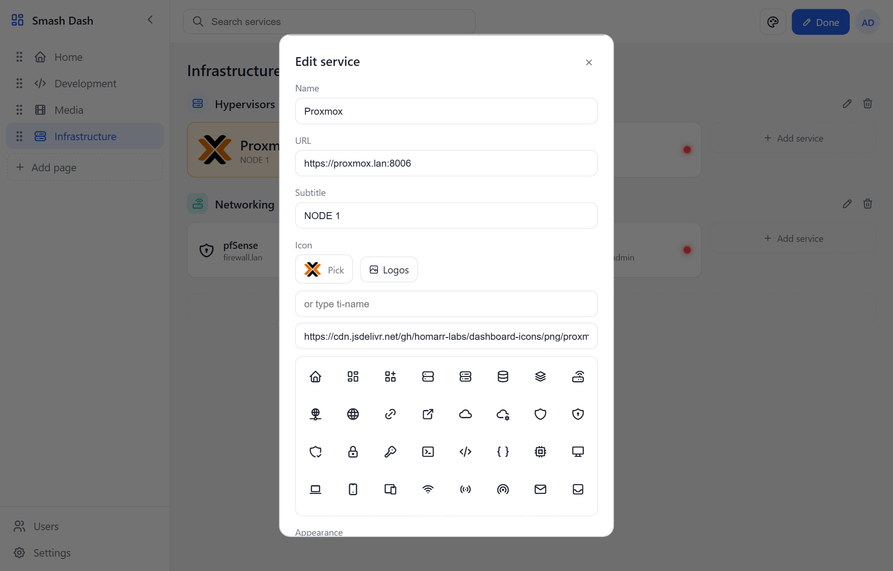

2. **Logos** — search thousands of real **product logos** (Plex, Sonarr, Proxmox, pfSense, …) from the community [dashboard-icons](https://github.com/homarr-labs/dashboard-icons) set. Type a product name and click the logo.

   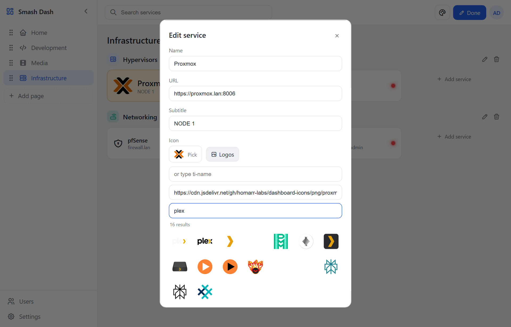

3. **Image URL** — paste any image URL to use a custom icon.

> The Logos picker fetches images from a CDN, so it needs an internet connection. The built-in Tabler icons and the rest of the app work offline.

---

## Tile appearance (size, colour, fonts)

In the tile editor, click **Appearance** to open the appearance panel.

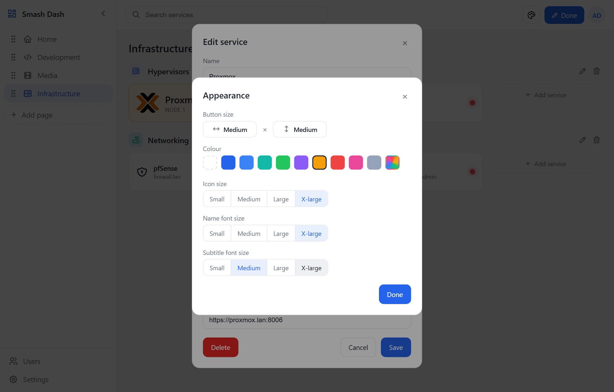

- **Button size** — set the tile's **width** and **height** independently (Small / Medium / Large). Click each to cycle through the sizes.
- **Colour** — tint the tile with one of the preset colours, or pick the **custom-colour** swatch (the rainbow chip) for any colour you like. The tint adapts to your current theme.
- **Icon size** — Small / Medium / Large / X-large.
- **Name font size** and **Subtitle font size** — Small / Medium / Large / X-large.

Every option defaults to the standard look, so tiles you don't customise stay consistent.

---

## Sections (categories)

A page can hold as many sections (categories) as you want. In edit mode, click **Add section** at the bottom of a page. Each section has its own **title**, **icon**, and **colour**, and shows a count of the tiles inside it. Drag sections to reorder them.

---

## Search

Use the **Search services** box at the top to filter tiles on the current page by name, subtitle, or URL.

---

## Themes

Click the **palette** button (top-right) to switch themes instantly. Each user keeps their own choice.

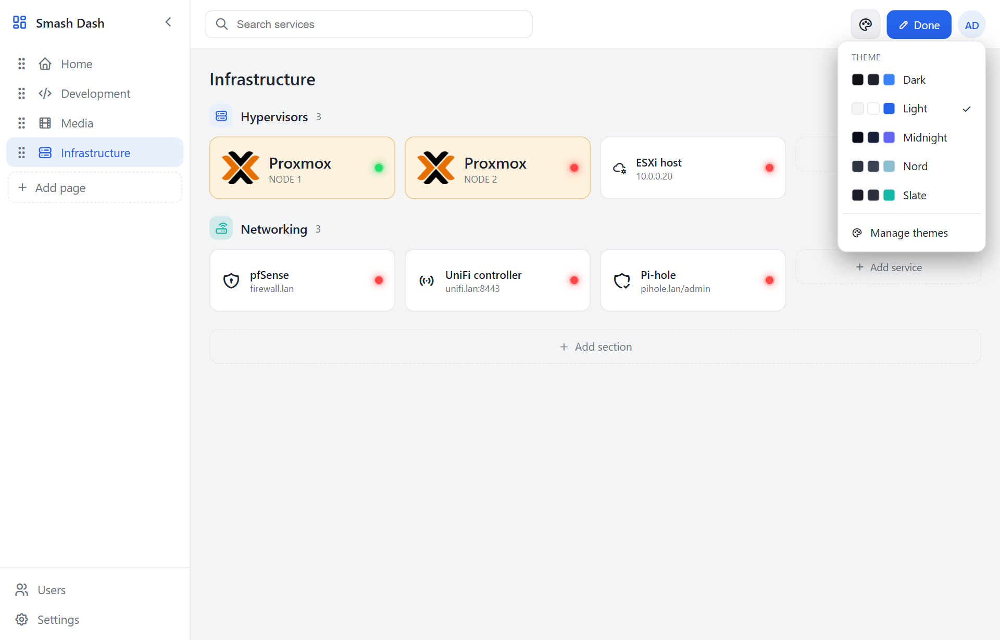

There are five built-in themes (Dark, Light, Midnight, Slate, Nord). Admins can open **Manage themes** to create or edit custom themes — every colour in the UI is a token you can change.

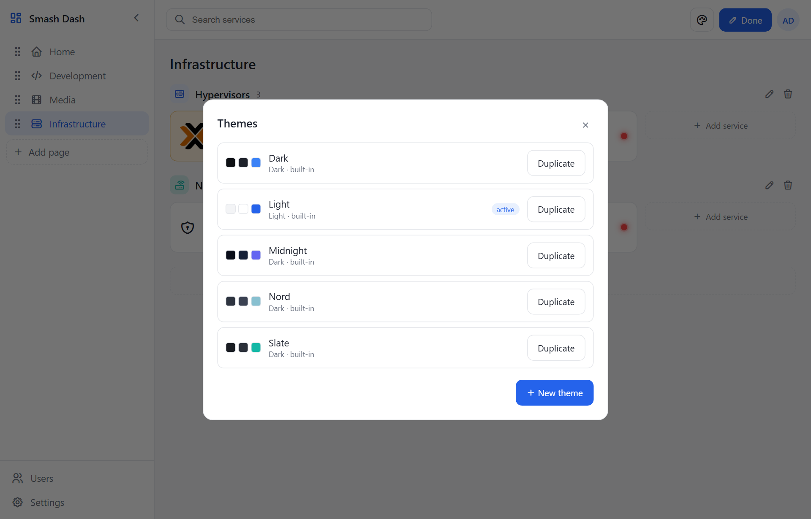

The **default theme** (used for new users and the login screen) is set under **Settings**.

---

## Users & roles

Admins manage accounts under **Users** (sidebar, or the user menu).

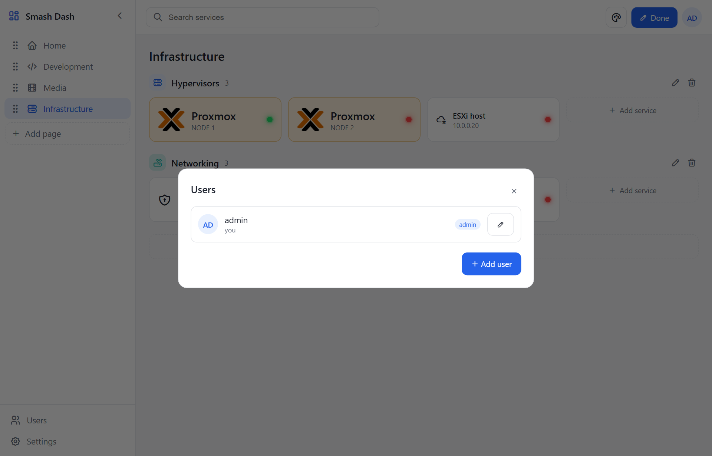

There are two roles:

- **Admin** — can edit everything (pages, sections, tiles, themes, users, settings).
- **Viewer** — can view the dashboard and pick their own theme/avatar, but can't change the layout.

The last remaining admin can't be demoted or deleted, so you can never lock yourself out.

---

## Your profile

Open the **user menu** (your avatar, top-right) → **Edit profile** to set your **avatar**. Choose a Tabler icon or paste an image URL; leave it blank to use your initials. Any user can set their own.

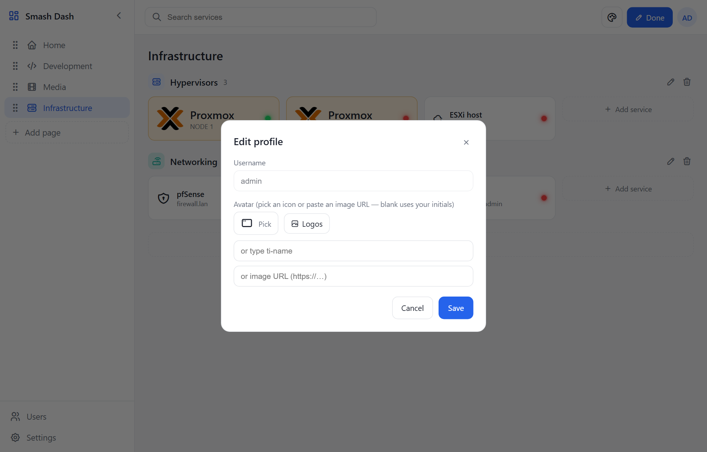

---

## Status monitoring

Every tile shows a small **status dot**:

- 🟢 **green** — the service responded (it's reachable / up)
- 🔴 **red** — no response (unreachable, timed out, or DNS failed)
- ⚪ **grey ring** — unknown / not checked (no usable URL, or monitoring is off)

Hover a dot for the response time and HTTP status.

The server checks each service on an interval (using the tile's **Health check URL** if set, otherwise its URL). It's built for homelabs:

- **Self-signed TLS certificates are accepted** (e.g. Proxmox on `:8006`).
- **Any HTTP response counts as "up"** — including auth-gated services that return 401/403, or redirects — so only genuine connection failures show red.

### Adjusting the check interval

Open **Settings** and set **Status check interval** (in seconds). `0` turns monitoring off; the minimum is 5 seconds. The change takes effect immediately.

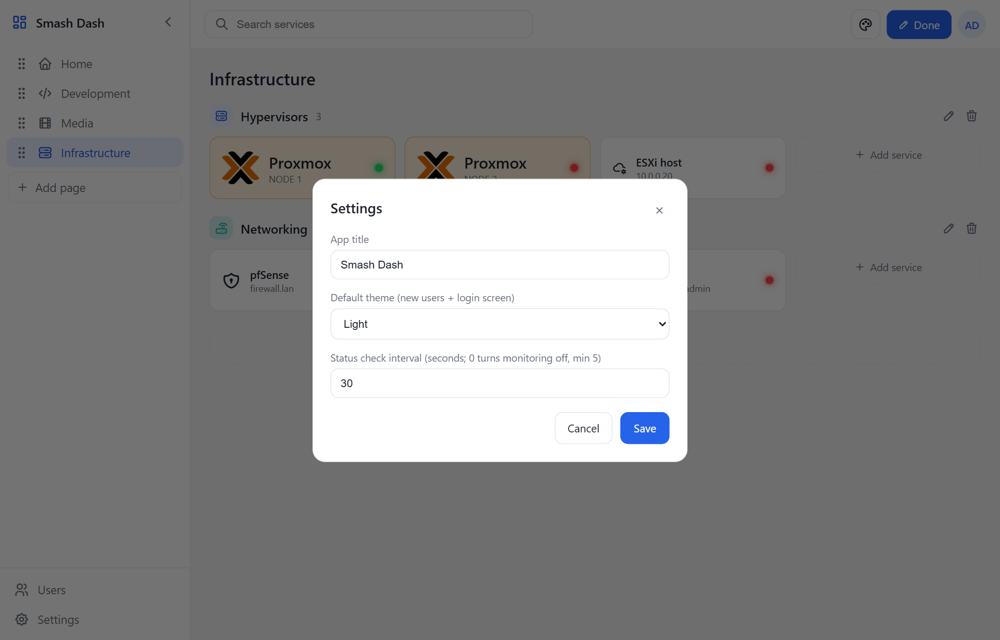

You can also set the default via the `CHECK_INTERVAL_MS` environment variable — but the Settings value, once saved, takes precedence.

---

## The sidebar

Click the **chevron** at the top of the sidebar to collapse it to icons (handy on smaller screens). Your choice is remembered per user and per browser.

---

## Backup & data

All your data lives in a single SQLite file, **`smashdash.db`**:

- **Docker:** inside the `smashdash-data` volume — back it up by copying `smashdash.db` out of the volume.
- **Local:** under `./data/` (or wherever `DATA_DIR` points).

To back up, just copy that file while the app is stopped (or use SQLite's online backup).

---

## Configuration reference (environment variables)

| Variable | Default | Purpose |
|---|---|---|
| `PORT` | `3000` | Listen port |
| `DATA_DIR` | `/data` (Docker) · `./data` (local) | Where the SQLite database lives |
| `ADMIN_USERNAME` | `admin` | First-run admin username |
| `ADMIN_PASSWORD` | `admin` | First-run admin password |
| `COOKIE_SECURE` | `false` | Set `true` when served over HTTPS |
| `CHECK_INTERVAL_MS` | `30000` | Default status-check interval in ms (`0` disables). Overridden by the **Settings** value |
| `CHECK_TIMEOUT_MS` | `5000` | Per-service status-check timeout in ms |
| `TZ` | — | Container timezone |

---

*Built with Node.js (Fastify), SQLite, and a vanilla-JS frontend — single container, single database file.*
